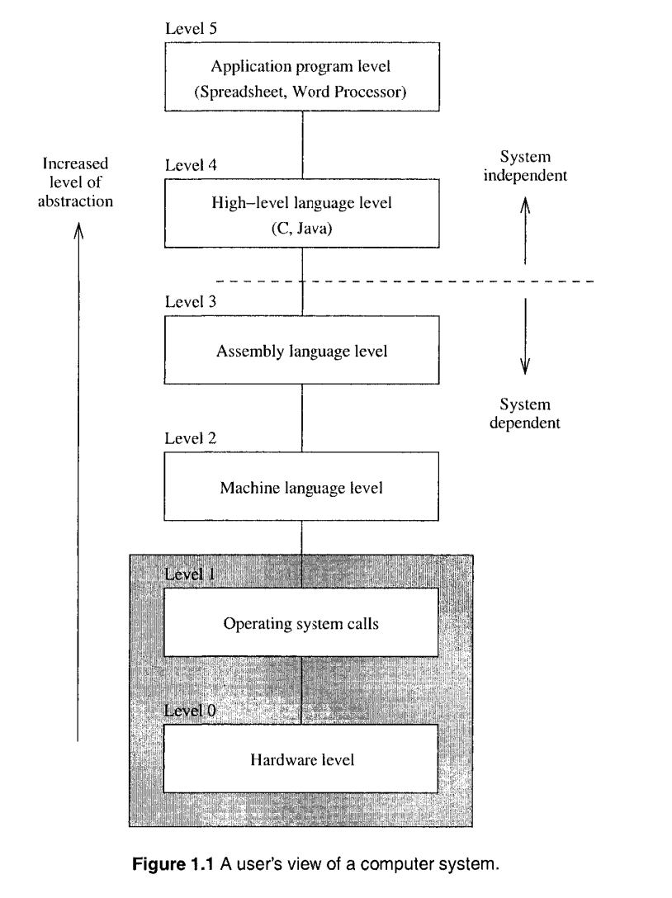

# PART I Overview

这一节主要的目的就是让读者对汇编语言有一个简单的认识。

用户对计算机系统的视角取决于与之打交道的软件的硬件抽象程度。

由下往上地，由于软件的抽象程度越高，使得用户的视角发生转变。

汇编语言是平台相关的，简单地来说，使用 Intel 指令集编写的汇编程序无法运行于 PowerPc 构架之上。换句话说，使用汇编语言编程，要求操作人员对系统内部的的运行机制有所了解，比如处理器构架，内存分布等等。

这并不是说使用汇编语言就必须对底层的硬件完全了解，因为操作系统会提供一些便捷方式来方便我们程序的编写。当然，如果是使用汇编语言编写操作系统的话，就另说了。

汇编语言是直接受到指令集以及处理器构架所影响的。这本书将主要讨论的是 Intel 32-bit 构架处理器上的汇编程序。

高级语言具有开发速度以及跨平台的特性，那么为什么还需要学习汇编语言呢？因为汇编语言可以最灵活、最大程度地榨干硬件的性能。不过从我个人角度而言，学习汇编并不是为了性能，而是尽管高级语言会提供一定程度的硬件抽象，但是仍然不能 100% 的屏蔽硬件的细节。反过来，在学习了汇编语言之后，接触到硬件的细节，更有助于理解上层为什么采用那些抽象形式。