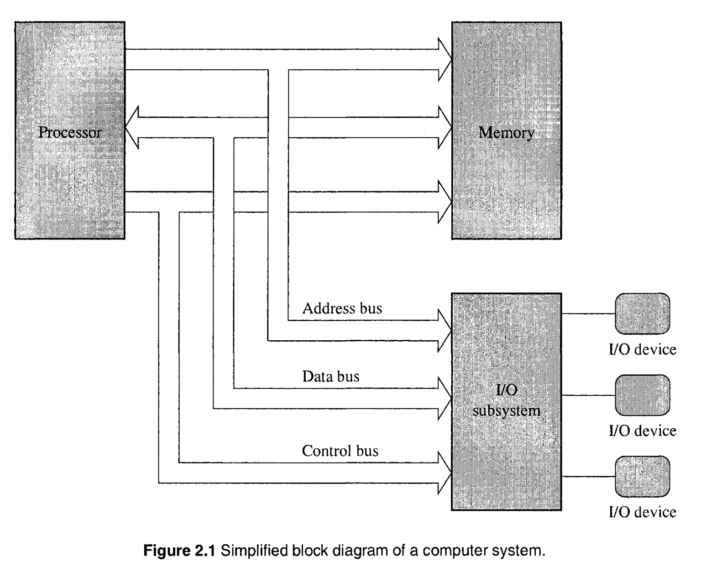
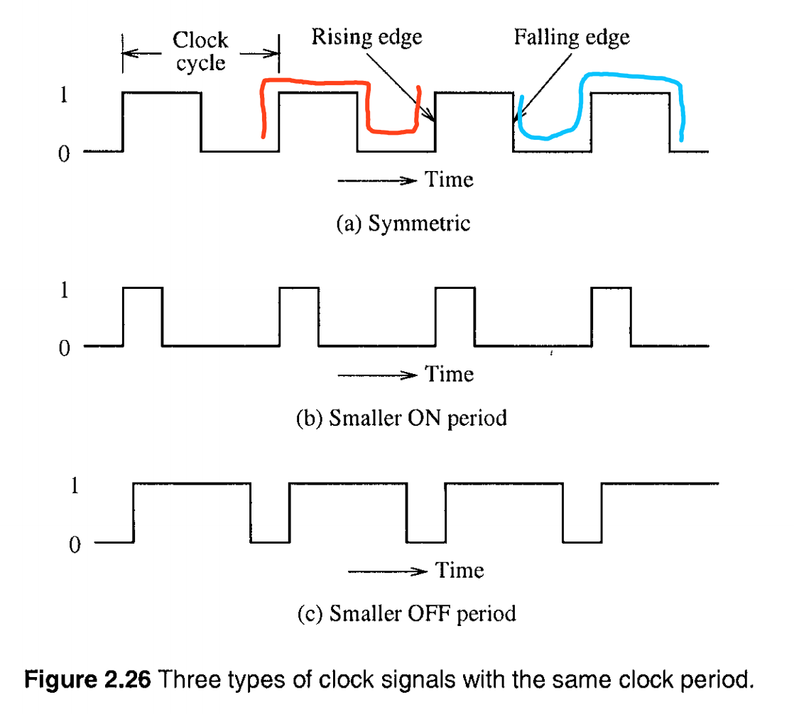

# 数字逻辑电路 (Digital Logic Circuits)

计算机系统主要有 3 个组件构成: 一个中央处理单元(Central Processing Unit - CPU)，一个内存单元，以及输入输出设备。这些组件通过 系统总线(System Bus) 相连。

系统总线又主要分为三部分: 一根 地址总线(Address Bus)，一根 数据总线(Data Bus)，一根控制总线(Control Bus)。



地址总线的带宽，说明了处理器的最大寻址范围。数据总线的带宽，说明了各个组件之间每次传递的最大数据量。比如 8086 处理器有一根 20bit 带宽的地址总线，和一根 16bit 的数据总线。那么该处理器最大寻址范围是 2^20 个字节，或 1MB，每次数据传递量为 16bit。再比如 奔腾(Pentium) 处理器，它拥有 一根 32bit 地址总线和一根 64bit 数据总线，因此寻址范围可达 2^32 个字节，或 4GB，每次数据传输量可为 64bit。

之所以成为总线，可以理解为将一组线捆绑起来。比如带宽为 20bit 的总线，可以理解为该线内部含有 20 根线，每根线可以传输的电信号为 0 和 1，因此组合起来可以传输的信号有 2^20 种。

算术和逻辑单元(Arithmetic and Logic Units - ALU)，是 CPU 内部的主要组成部分，承担算数和逻辑的计算任务，本质上就是一些门(gate)电路。

## 时钟周期 (Clock Cycle)

之所以着重记录时钟周期的相关内容，是因为它是市面上主流的衡量 CPU 的指令执行速度的指标。

简单的说，Clock Cycle 就是一对 rising edges 或者一对 failling edges 之前的时间，见下图红色和蓝色的线



这个图表示的是振荡器的输出信号，应该是可以使用示波器显示出来这样的结果的吧。

所谓振荡器，就是一个可以不依赖外部、可以自身向外提供时间信号的电子元件。CPU 内部可以理解成多个门电路的组合，而门电路的工作原理就是充放电。CPU 的工作就是不停地执行指令，如果当前指令尚未执行完成，下一个执行就开始执行的话，就会产生未知的结果，因此需要一个可以提供稳定时钟信号的元件，即振荡器。

CPU 执行每个指令所需的时钟周期是固定的，比如执行 指令A 需要 3 个时钟周期，那么由于振荡器的存在，每个时钟周期到了都会告知 CPU，CPU 加以记录，于是在 3 个时钟周期到了之后，CPU 可以执行接下来的指令。

时钟频率(Clock Frequency) 表示的是每秒时钟周期数(number of cycles per second)，单位是 赫兹(Hertz-Hz)。时钟周期对应的时间计算方式为:

```
clock-period = 1 / clock-frequency
```

比如时钟频率为 1GHz，那么一个时钟周期对应的时间为 `1 / 10^9 = 1ns`。

需要注意的是，一些 CPU 是支持超频的，那么如何理解这一行为。比如有 CPU 执行指令 A 需要 3 个时钟周期，而它一般工作的时钟频率为 300Hz，那么该 CPU 每秒可以执行指令 A 100次。而它的产品说明上标注该 CPU 可以超频到 600Hz，那么在超频的情况下，该 CPU 每秒可以执行指令 A 200次。这是因为 CPU 内部执行每个指令所需的时间，可以理解成是一个范围时间，只要指令在它允许的时间范围内被执行，都是可以的，但是如果超过这个范围，就是导致原件的损坏。而具体工作在这个时间范围的哪一点，就可以由振荡器来动态的调整。

需要说明的是，时钟频率并不是衡量 CPU 性能的唯一指标，并且，在以时钟频率还衡量 CPU 性能的时候，一定要结合 CPU 的构架一起考虑。也就是说，在相同的构架下去比较时钟频率才是有意义的。相同的构架，其实是要表示对于某一指令，所需的时钟周期是相同的。

假设 CPU A 和 B 为相同的构架，即执行 指令C 都需要 3 个时钟周期，A 的时钟频率为 300Hz，B 的时钟频率为 600Hz，那么显然，B 执行 指令C 的性能要高于 A。

假设 CPU A 和 B 为异构，它们都支持指令 C。CPU A 执行 C 的时钟周期为 1， CPU B 执行 C 的时钟周期为 3，CPU A 的时钟频率为 300Hz，CPU B 的时钟频率为 600Hz。那么很显然，CPU A 每秒执行了 指令C 300次，而 CPU B 每秒执行了 指令C 200次，尽管 CPU A 的时钟频率低于 CPU B 的时钟频率，但是对于指令 C 的执行结果而言，A 的性能仍高于 B。

关于振荡器以及时钟频率的扩展阅读:

* [Why is an oscillator integrated into a CPU and why is clock cycle chosen to represent CPU's speed?](https://www.quora.com/Why-is-an-oscillator-integrated-into-a-CPU-and-why-is-clock-cycle-chosen-to-represent-CPUs-speed)

*这一章节中有很多关于控制电路的细节，就不深入研究了。*