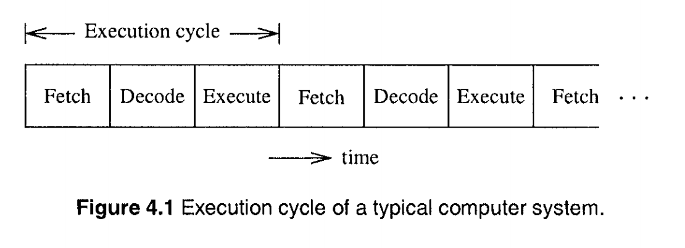
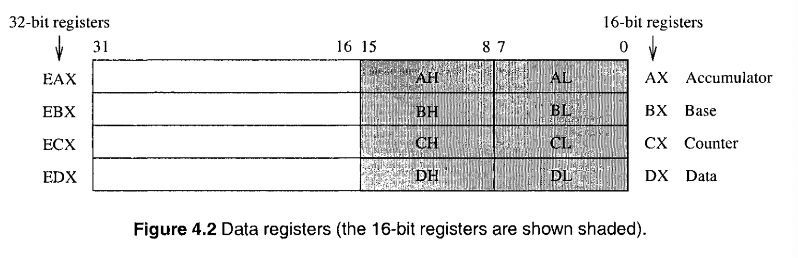
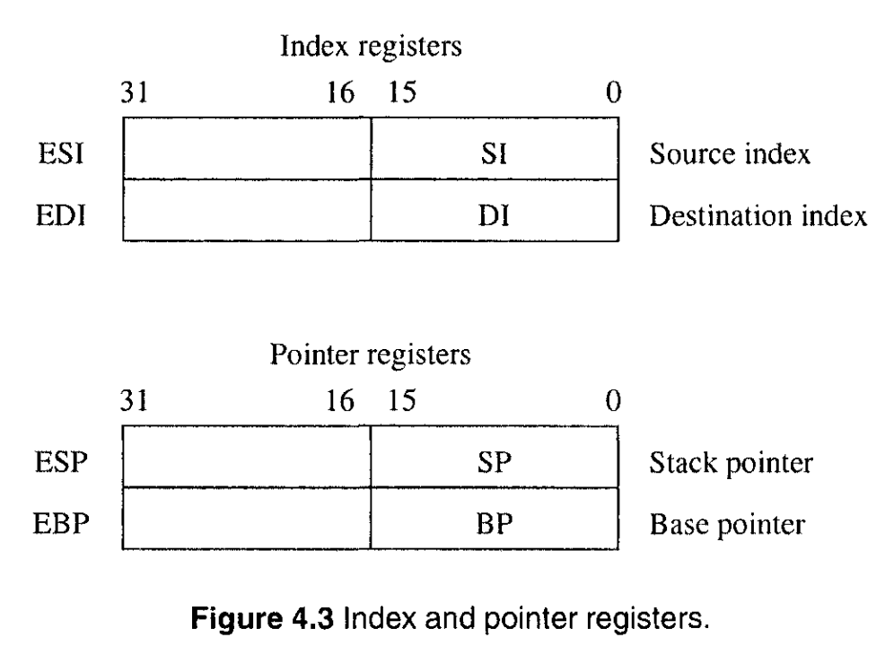
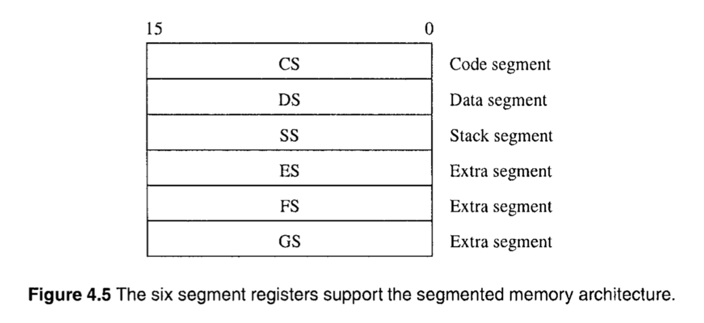
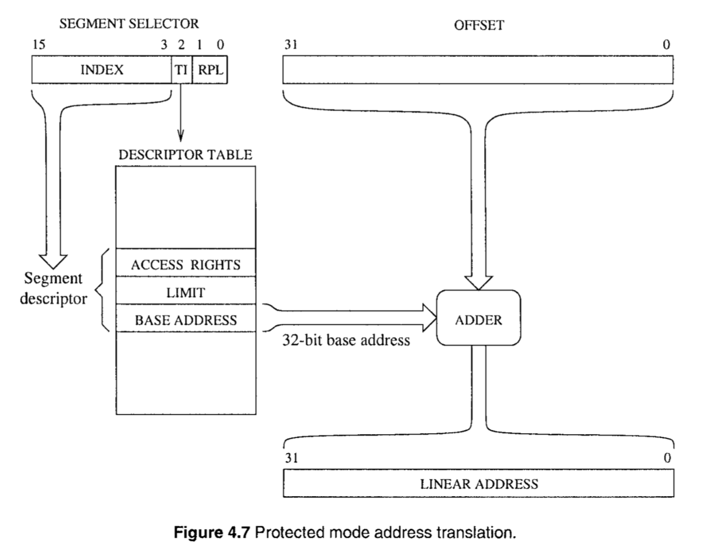
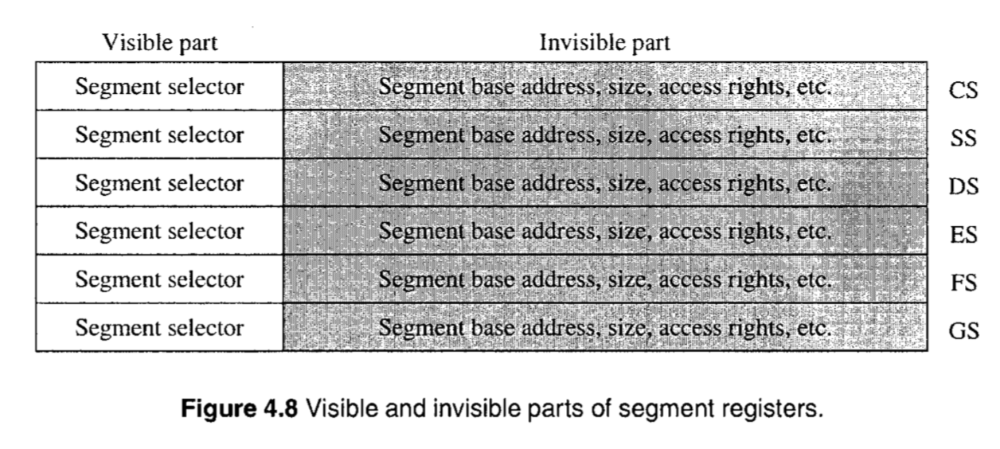
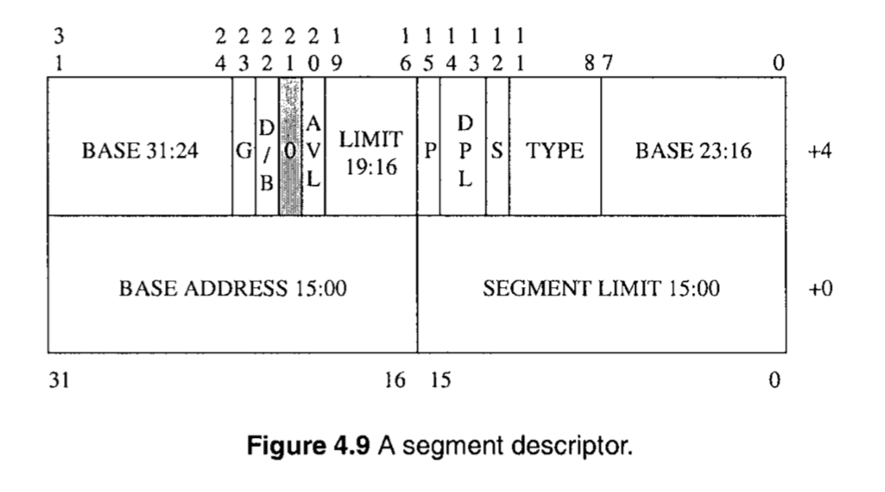
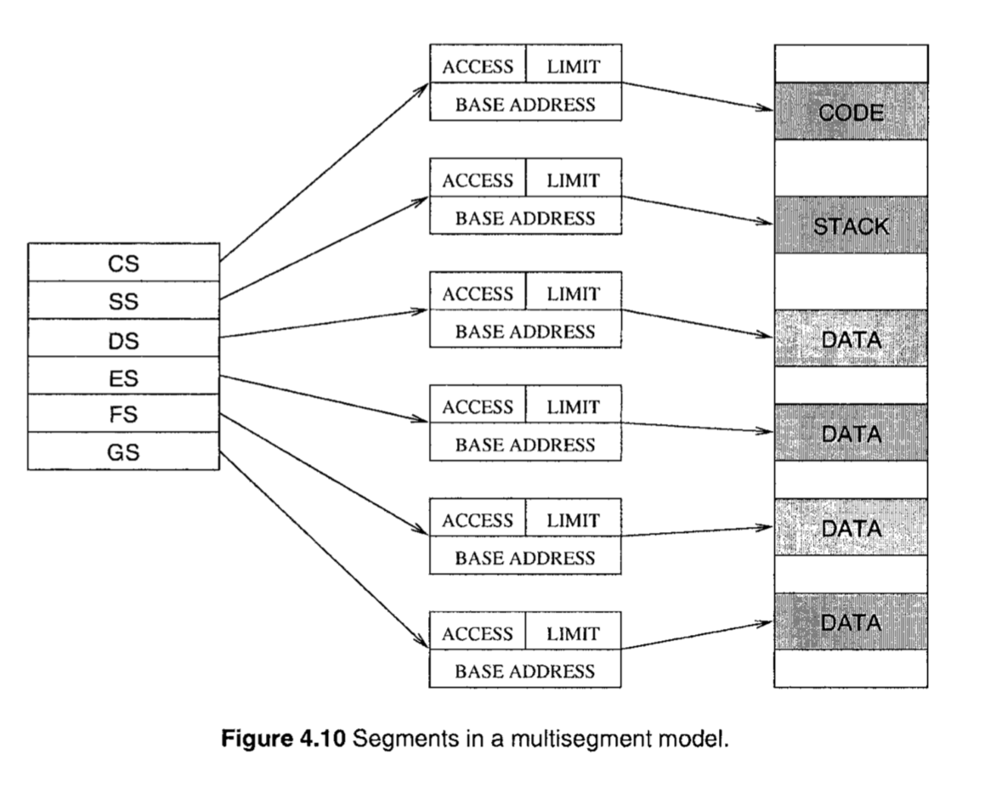
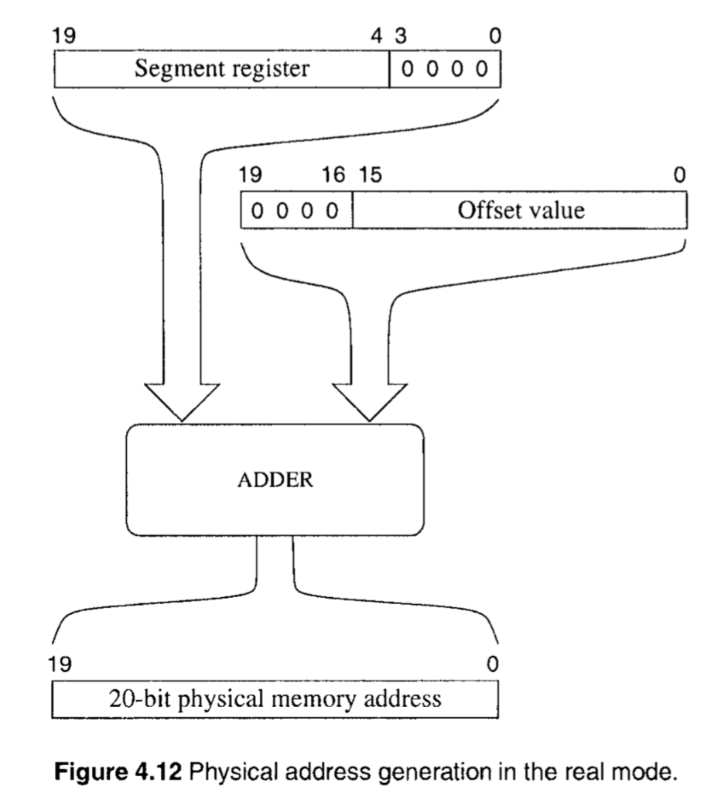
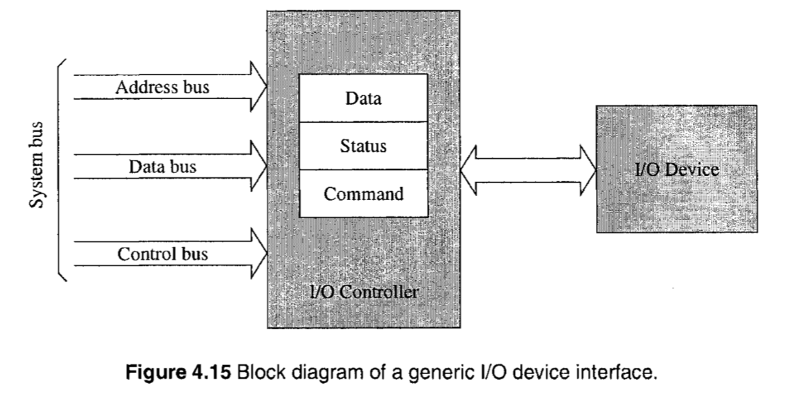

- [介绍 (Introduction)](#%E4%BB%8B%E7%BB%8D-introduction)
- [处理器执行周期 (Processor Execution Cycle)](#%E5%A4%84%E7%90%86%E5%99%A8%E6%89%A7%E8%A1%8C%E5%91%A8%E6%9C%9F-processor-execution-cycle)
- [处理器中的寄存器 (Processor Registers)](#%E5%A4%84%E7%90%86%E5%99%A8%E4%B8%AD%E7%9A%84%E5%AF%84%E5%AD%98%E5%99%A8-processor-registers)
  - [数据寄存器 (Data Registers)](#%E6%95%B0%E6%8D%AE%E5%AF%84%E5%AD%98%E5%99%A8-data-registers)
  - [指针和索引寄存器 (Pointer and Index Registers)](#%E6%8C%87%E9%92%88%E5%92%8C%E7%B4%A2%E5%BC%95%E5%AF%84%E5%AD%98%E5%99%A8-pointer-and-index-registers)
  - [控制寄存器 (Control Registers)](#%E6%8E%A7%E5%88%B6%E5%AF%84%E5%AD%98%E5%99%A8-control-registers)
  - [段寄存器 (Segment Registers)](#%E6%AE%B5%E5%AF%84%E5%AD%98%E5%99%A8-segment-registers)
- [保护模式下的内存架构 (Protected Mode Memory Architecture)](#%E4%BF%9D%E6%8A%A4%E6%A8%A1%E5%BC%8F%E4%B8%8B%E7%9A%84%E5%86%85%E5%AD%98%E6%9E%B6%E6%9E%84-protected-mode-memory-architecture)
  - [段寄存器 (Segment Registers)](#%E6%AE%B5%E5%AF%84%E5%AD%98%E5%99%A8-segment-registers-1)
  - [段描述符 (Segment Descriptors)](#%E6%AE%B5%E6%8F%8F%E8%BF%B0%E7%AC%A6-segment-descriptors)
  - [段描述符表 (Segment Descriptor Tables)](#%E6%AE%B5%E6%8F%8F%E8%BF%B0%E7%AC%A6%E8%A1%A8-segment-descriptor-tables)
  - [分段模型 (Segmentation Models)](#%E5%88%86%E6%AE%B5%E6%A8%A1%E5%9E%8B-segmentation-models)
- [Real Mode Memory Architecture](#real-mode-memory-architecture)
- [Mixed-Mode Operation](#mixed-mode-operation)
- [该使用哪一个寄存器 (Which Segment Register to Use)](#%E8%AF%A5%E4%BD%BF%E7%94%A8%E5%93%AA%E4%B8%80%E4%B8%AA%E5%AF%84%E5%AD%98%E5%99%A8-which-segment-register-to-use)
- [Input/Output](#inputoutput)

这一章节将提供一些因特尔32位处理器架构的细节。奔腾、赛扬，以及至强都属于这个架构。我们将介绍寄存器以及内存的架构细节。它支持两种内存架构：protected-mode 和 real-mode。protected-mode 是原生模式(native mode)，real-mode 是模拟的 16位的 8086 内存架构。两种模式都支持段内存架构。对于汇编语言编程而言，理解段内存的组织形式是很重要的。

## 介绍 (Introduction)

这一节就是介绍下一些历史背景。这里有个有意思的故事，此前一直不明白为什么因特尔对 CPU 的命名从数字转换为单词 - 80 系列到 奔腾系列。原来是因特尔发现数字无法注册商标，哈哈。

接下来将会看下 IA-32 的基础架构。

## 处理器执行周期 (Processor Execution Cycle)

系统运作的核心就是处理器，它可以认为是在不断地周期性地执行下面的动作:

1. 从内存中取出一条指令
2. 解码指令 (比如: 识别指令 - 找到指令所对应的动作)
3. 执行指令 (比如: 执行指令所对应的动作)

这个执行过程也被称为 `fetch-decode-execute` 周期。见下图:

Fetching，从内存中取出指令涉及到将适当的内存地址放到地址总线上，然后通过控制总线发出内存读取信号，告知内存单元需要从该地址上读取一条指令。内存单元需要一定的时间读取指定地址上的指令。在读取后，内存单元将指令放置到数据总线上。处理器在命令内存单元读取指令后，就处于等待状态，直到内存单元完成指令的读取、并将指令放置到数据总线上之后，从数据总线上读取指令。

Decoding，目的是识别从内存中读取的指令。为了简化解码的流程，机器指令都是按照特定的格式进行编码的。

为了执行(execute)指令，处理的包含了两个硬件组成部分: 控制电路(control circuitry)和 算术逻辑单元(arithmetic and logic unit - ALU)。控制电路的作用是提供定时功能，以便处理器内部的硬件组件执行指定的操作。算术控制电路主要是负责执行算术和逻辑运算。

在实际运行中，大部分情况下，指令并不需要从内存中取得，这是因为处理器内部包含了高速缓存单元，该单元会将内存中的指令缓存到其中，并提供比内存更快的读取速度。

## 处理器中的寄存器 (Processor Registers)

IA-32架构提供了 10个32位 和 6个16位寄存器。这些寄存器被分为 general, control 和 segment 寄存器。general 又进一步被划分为 data, pointer, index 寄存器。

### 数据寄存器 (Data Registers)

有 4 个 32位 数据寄存器用于存放算术，逻辑或者其他操作。它们比较特殊，可以这样使用:

* 4个 32位 寄存器 (EAX, EBX, ECX, EDX)
* 4个 16位 寄存器 (AX, BX, CX, DX)
* 8个 8位 寄存器 (AH, AL, BH, BL, CH, CL, DH, DL)

像 图4.2 中展示的那样，可以通过 32位 寄存器对应的 16位 寄存器的名字来方位 32位寄存器中低半部分的数据。比如 EAX 的低半部分的数据，可以通过 AX 得到。进一步的，AX 的高半部分可以通过 AH 得到、低半部分可以通过 AL 得到。

在执行大部分的算术和逻辑指令时对数据寄存器的使用没有什么特别要求。不过对于某些指令而言，对数据寄存器的使用有要求。比如执行乘法操作时，两个操作数中的一个必须存在于 EAX, AX, 或者 AL，具体以依赖于操作数的大小。相似的，ECX 和 CX 寄存器在执行迭代指令时被假定存放了循环次数。

### 指针和索引寄存器 (Pointer and Index Registers)

图4.3 中的两个 index registers 在进行字符串处理时扮演特殊的角色，除此之外可以像使用一般寄存器一样使用它们。

指针寄存器主要用于维护数据栈。即便它们可以当做一般寄存器来使用，绝大部分情况下，它们的功能只限定于维护数据栈。数据栈的实现在 [Chapter 11]()

### 控制寄存器 (Control Registers)

控制寄存器有两个: 指令指针寄存器(instruction pointer register) 和 标志寄存器(flags register)。处理器使用指令指针寄存器来记录下一个需要执行的指令的位置。instruction pointer register 又被成为 program counter register。指令指针寄存器可以作为 16位寄存器(IP) 或 32位寄存器(EIP) 来使用。

当指令从内存中被取得后，instruction pointer 被更新为下一条指令的位置。当需要将控制权转移到程序中的其他位置时，也会更新该寄存器的内容(比如 jump, procedure call 或 interrupt - 跳转，过程调用或中断)

标志寄存器也可以当做是 16位 FLAGS 寄存器或者 32位 EFLAGS 寄存器。FLAGS 寄存器用于 8086 处理器的代码。EFLAGS 寄存器包含 6 个状态(status)标志，1 个 控制(control) 标志，和 10个 系统(system)标志，见图 4.4。通过将对应的 bit 置为 1 来启用，通过设置 0 来复位。IA-32 指令集提供了一些指令来设置和复位一些标志位。比如 clc 指令来复位 carry 标志，stc 指令来启用 carry 标志。

6个状态(status)标志记录了一些关于最近的算术或者逻辑运算的信息。比如，如果减法操作产生了 0 值，那么 zero 标志位(ZF) 将被设定(ZF = 1)。[Chapter 14]() 将讨论这些标志位。

控制标志(control flag)在操作字符串时起作用。这个标志决定了字符串扫描的方向。[Chapter 17]() 中进行讨论。

10 个系统标志控制了处理器的操作。将部分讨论其中的标志。[Chapter 20]() 将讨论 trap enable flag(TF) 和 interrupt enable flag(IF)。

对齐检查(alignment check - AC)标志，当该标志启用时，处理器将执行对齐检查，在遇到未对齐的引用时，会抛出异常。

### 段寄存器 (Segment Registers)

图4.5中展示了 6个 16位的段寄存器。这些寄存器支持以段的形式来组织内存。在这种组织形式下，内存被划为一个个段。在任何时候，处理器只能访问这 6个 段寄存器所关联的内存。

一个程序逻辑上可以被分为两部分: 代码部分(code part) 只包含指令，数据部分(data part) 只包含数据。代码段(code segment - CS)寄存器 指向了内存中的程序代码部分，数据段(data segment - DS)寄存器指向了内存中的程序的数据部分。栈段(stack segment)寄存器指向了程序的栈段，[Chapter 11]() 讨论。

最后三个段寄存器 ES, FS, GS - 可以当做上面的寄存器使用。比如，如果程序的数据无法完全存在单个数据段，那么可以通过使用多个段寄存器来存放。

## 保护模式下的内存架构 (Protected Mode Memory Architecture)

保护模式支持一个成熟的分段机制。在这个模式下，分段单(segment unit)元将一个逻辑地址转换成一个32位线性地址。分页单元(pading unit) 将线性地址转换成一个32位物理地址。如图4.7所示。

在保护模式下，段寄存器的内容存放的是 segment descriptor table 中的索引，segment descriptor 提供了一个32位的段基地址，段大小，和段的访问权限。为了将逻辑地址转换成对应的线性地址，需要在段基地址上增加偏移量。偏移量可以是16位或者32位数。

### 段寄存器 (Segment Registers)

每一个段寄存器都有一个 可见(visible)部分 和一个 不可见(invisible)部分，见图4.8。

可见部分称为 段选择器(segment selector)。有直接的指令来载入 segment selector。这些指令包括 mov, pop, lds, les, lss, lgs 和 lfs。不可见部分由处理器自动的从 descriptor table 中载入。

如图4.7，segment selector 提供了一下三部分信息:

* Index: 索引用于从两个描述符表中的一个里面选择段描述符，两个表可以是本地描述符表(local descriptor table) 或者 全局描述符表(global descriptor table)。因为 index 是一个 13位的值，所以可以选择 2^13 = 8192 个描述符中的一个。因为每个描述符都是 8 字节长的，为了得到描述符的内存地址，处理器会将索引乘以 8 再加上描述符表的基地址。

* Table Indicator(TI): 这个 bit 表示是使用本地还是全局描述符表。0 代表全局，1 代表本地。

* Request Privilege Level(RPL): 这个字段表示了需要采用数据保护的级别。数值越小，级别越高。操作系统并不需要使用所有的 4 个级别。比如，Linux 对内核使用了级别 0, 对用户程序使用级别 3，并没有使用级别 1 和 2。 

### 段描述符 (Segment Descriptors)

段描述符提供了段的相关属性。这些属性包括 32基地址，20位段大小以及控制和状态信息，见图4.9

下面对图中的一些字段进行简述:

* Base Address: 一个 32位 的地址，表示了该段位于 4GB 物理内存中的起始位置。这个基地址加上偏移量得到 32位线性地址。

* Granularity(G): 这个 bit 表示了段的大小的单位。以字节位单位还是 4KB位单位。如果 granularity bit 是 0 的话，表示单位是字节，否则单位是 4KB。

* Segment Limit: 这是一个 20 位的数，表示段的大小。结合 granularity bit，可以有两种解释:

  * 如果 granularity bit 是 0 的话，segment size 可以从 1byte 到 1MB，以一个字节为增长步长。
  * 如果 granularity bit 是 1 的话，segment size 可以从 4KB 到 4GB，以 4KB 为增长步长。

* D/B Bit: 在代码段中，被称为 D bit, 表示默认的操作数和便宜的大小。如果 D 是 0，默认的操作和偏移量为 16位。对于 32位的操作数和偏移量而言，D bit 必须设置为 1。在数据段中，被称为 B bit，用于控制栈和栈指针的大小。如果 B bit 是 0 的话，那么栈的大小上限为 0xFFFF，且使用 SP 寄存器；如果 B bit 是 1 的话，将使用 ESP 寄存器，且栈的大小上限为 0xFFFFFFFF，书中以 H 结尾即表示 16 进制的数，为了方便阅读，这里使用的是 `0x` 前缀。通常在 real-mode 下该位被清除，在 protected-mode 下被设置。

* S Bit: 该 bit 表示该段是系统段(system segement)还是应用程序段(application segment)。如果该 bit 是 0，则表示是系统段，否则是应用程序段。

* Descriptor Privilege Level (DPL）: 这个字段定义了段的权限级别。当需要使用处理器的保护机制的时候需要使用该字段。

* Type: 这个字段表示段的类型。具体的解释取决于该段是系统段还是应用程序段。对于应用程序段，又取决于该段是代码段还是数据段。对于数据段而言，type 字段可以标识段上数据是只读，可读写等。对于代码段，type 字段可以标识段上数据是只执行，执行和可读，等。

* P Bit: 该字段用于表示段是否存在。如果 bit 是 0，当处理器将段描述符载入时，会生成一个 segment-not-present 异常。

### 段描述符表 (Segment Descriptor Tables)

段描述符表就是段描述符组成的数组。有三种类型的描述符表:

* 全局描述符表 (GDT)
* 本地描述符表 (LDT)
* 中断描述符表 (IDT)

这三个描述表的大小都不是固定的，范围在 8bytes 到 64KB 之间不等。中断描述符表将在 [Chapter 20]() 中讨论。LDT 和 GDT 的上限都是 2^13 = 8192个描述符。在图4.7中，segment selector 中的高位 13位 作为该描述符在其对应的表中的索引。每个表都有一个相关的寄存器来保存 32位 线性基地址和 16位 的表大小。 LDTR 和 GDTR 寄存器就是这样的用途。这些寄存器可以通过指令 lldt 和 lgdt 来加载，类似的，LDTR 和 GDTR 寄存器的值可以通过指令 sldt 和 sgdt 来保存。这些指令通常由操作系统来使用。

全局描述符表在整个系统中只有一个，被系统中的所有任务所共用。通常而言，GDT 包含了操作系统所使用的代码和数据。LDT 中包含了特定程序所使用的描述符。可以有多个 LDT。只有当 GDT 或者 LDT 中存在一个段的描述符时，该段才得以被一个程序所访问。

### 分段模型 (Segmentation Models)

段可以将整块的内存进行分割。当然可以无视分段模式，只需要将所有段的基地址设置为 0，并将大小设置为 4GB。这种模型被称为 flat model，在 UNIX 和 Linux 中被使用。

另一种则是充分利用分段的模型，称为 moltisegment model。见图 4.10

图4.10展示了 6个 寄存器映射的例子。一个程序实际上可以使用多于 6个 的寄存器。在这个情况下，该程序所关联的描述符表中将载入所有被该程序使用的段的描述符。不过，无论何时，只可以有 6 个活动的段。所谓活动的段，即该段的描述符被载入到段寄存器中。为了激活一个段，可以将该段的 segment selector 载入到段寄存器中，然后处理器会自动的载入对应的 segment descriptor(见图4.8)。如果访问的地址操作的段的范围，处理器会生成 general-protection 异常。

## Real Mode Memory Architecture

该节和下一节的 Mixed-Mode Operation 都是讲的 16位 8086处理器 的方式，就略过了。

一个有意思的点可以记录一下，不光在硬件设计上，在软件中(比如 GC 设计) 中，也有很多利用地址整数倍而空余的低位 0 的情况。

8086 是 16 位的处理器，但是却可以支持 1M 的内存。实现的方式就是将内存进行分段，并假设所有的分段起始都是 16 的整数倍，进而低 4 位都为 0，所以可以只保存高 16 位。为了定位到段内的地址，还需要提供目标段内地址相对段基地址的偏移量，将这两个值交给地址累加器，来得到物理地址。见图4.12

对于每个逻辑地址，都有一个唯一对应的物理地址，反之则不然。*因为应试题型的惯性，所以记录这句，理解就好了。*

## Mixed-Mode Operation

略

## 该使用哪一个寄存器 (Which Segment Register to Use)

这里的讨论适用于 real 和 protected 两种模式。

指令读取(Instruction Fetch): 当访问内存用于读取指令时，CS 寄存器提供了段的基地址。偏移地址由 IP 或者 EIP 提供，取决于使用的 16位还是 32位地址模式。因此 CS:(E)IP 指向了下一条被读取的指令。

栈操作(Stack Operations): 当访问内存用于栈操作时，比如 push 或者 pop，SS 寄存器用于提供段基地址，偏移地址由 SP 或者 ESP 提供。对于栈上的一些其他操作，BP 或者 EBP 提供偏移地址，[Chapter 11]() 讨论这些内容。

访问数据(Accessing Data): 如果访问内存的目的是为了读写数据，那么 DS 寄存器是作为提供段基地址的默认选择。根据地址的模式不同，可以有不同的偏移量。地址模式 (Address modes) 将在 [Chapter 13]() 中讨论。

## Input/Output

通过 IO设备，使得系统可以和外界产生交互。IO设备可以是仅输入的设备(比如键盘)，仅输出的设备(比如显示器)，或者两个兼具的设备(比如磁盘)。这里简单的介绍一下 IO设备接口。[Chapter 20]() 将对 IO设备接口 提供更多的细节。

和外设(peripheral devices) 之间的交互，并不是直接进行的，而是通过 I/O controller 来进行，I/O controller 就相当于一个接口层。见图4.15

I/O 控制器一般有 3个 内部寄存器 - 一个数据寄存器，一个命令寄存器，一个状态寄存器，见图4.15。当处理器需要和某个 I/O 设备交互时，它只会和该设备所关联的 I/O 控制器通信。

当我们访问 I/O 设备时，通常情况下可以借助操作系统提供的功能。