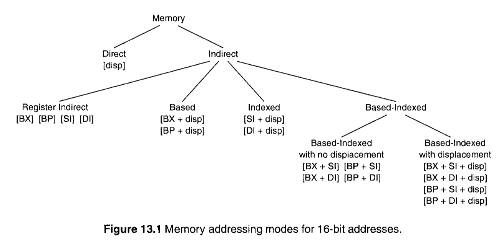
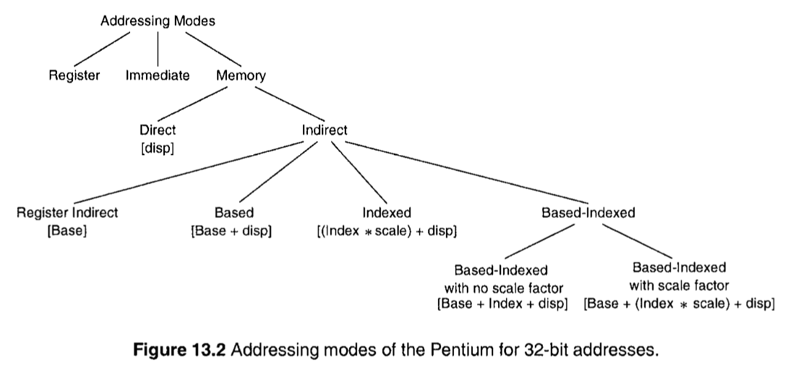
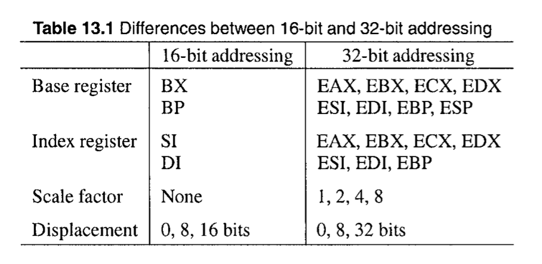

在汇编语言中，可以通过多种方式来指定指令执行所需的操作数。[Chapter 9](./a-first-look-at-assembly-language.md) 中我们已经讨论过四种不同的方式: register, immediate, direct, indirect，最后两个方式将操作数放在内存中。不过这样的操作方式可以通过其他几种方式来实现。现在我们来详细讨论这些寻址模式。

数组是组织相关集合类型数据的重要方式。尽管一位数组是容易维护的，多维数组也是必不可少的。这一节将详细讨论这点。

## 简介 (Introduction)

寻址模式(addressing modes) 表示的是我们如何提供指令操作所需的操作数。一个操作数可以位于下面任意一个地方: 寄存器，指令本身，内存，I/O port。[Chapter 20]() 将讨论 如果将操作数放置到 I/O port 上。这里我们将注意力放在前3种位置上:

* 寄存器寻址模式(Register Addressing Mode): 在这个模式中，[Chapter 9]() 中有所描述，处理器寄存器提供了作为输入的操作数，并且指令执行结果又会放回到寄存器中。因为 IA-32 架构使用了 two-address 格式，指定一个操作数时，即指定了 source 也指定了 destination。这个最佳的指定操作数的模式，因为操作数访问的延迟最低。
* 立即数寻址模式(Immediate Addressing Mode): 这个寻址模式可以提供最多一个操作数。操作数的值被编码成为指令的一部分。因此，当指令被读取的时候，操作数也变得可用。
* 内存寻址模式(Memory Addressing Mode): 当一个操作数在内存的时候，可以通过多种方式来指定它。之前我们需要使用逻辑地址来指定位于内存的操作数。逻辑地址包含两部分: 段基地址和偏移量，注意偏移量又称为有效地址(effective address。

在 Chapter 9 中，我们已经介绍了直接寻址和寄存器间接寻址。在间接寻址模式中，有效地址在其中一个通用寄存器中。这一节将讨论剩下的寻址模式。

## 内存寻址模式 (Memory Addressing Modes)





提供不同寻址模式的主要目的就是为了支持高级语言。具体可用的寻址模式给予正在使用的寻址大小(16位或32位)。8086 支持 16位的寻址模式，见图13.1。32位下支持更多灵活的寻址模式，见图13.2，并且总结如下:



处理器如何知道当前使用的是16位模式还是32位模式呢？[Chapter 4](/PART-II/the-ia-32-architecture.md) 中已经讨论过，处理器使用 CS段描述符中的 D bit 来确定当前是16位模式还是32位模式。不过，还是可以通过寻址大小覆盖前缀来覆写默认的寻址大小:

```
66H  Operand size override prefix
67H  Address size override prefix
```

通过这些前缀，我们可以混用16位和32位寻址模式。比如:

```asm
mov  EAX,123
```

汇编器将会生成下面的机器码:

```
B8 0000007B
```

如果我们使用16位的操作数

```asm
mov  AX,123
```

会生成下面的机器码:

```
66 | B8 007B
```

汇编器插入了操作数大小覆写前缀(66H)。同样的，我们可以16位的地址模式。比如:

```asm
mov  EAX,[BX]
```

汇编器自动的插入寻址大小覆写前缀(67H)：

```
67 | 8B 07
```

也可以同时使用这两个覆写前缀，比如:

```asm
mov  AX,[BX]
```

会生成:

```
66 | 67 | 8B 07
```

## 寻址模式

32位寻址的语法如下:

```
segment:[base register + index register * scale factor + displacement]
```

16位寻址语法如下:

```
segment:[base register + index register + displacement]
```

上面的语法是以 Intel 的语法作为演示。其中的各部分意义为，来自 Intel 手册:

> **3.7.5 Specifying an Offset**
> The offset part of a memory address can be specified directly as a static value (called a displacement) or through an address computation made up of one or more of the following components:
>
> * **Displacement** — An 8-, 16-, or 32-bit value.
> * **Base** — The value in a general-purpose register.
> * **Index** — The value in a general-purpose register.
> * **Scale factor** — A value of 2, 4, or 8 that is multiplied by the index value.
> 
> The offset which results from adding these components is called an effective address.

冒号(:)右边的部分，称为有效地址(effective address)。方括号中的各个因子又是可选的，相互组成构成不同的模式，见下 图13.1 和 图13.2


各个模式的详细例子见 [addressing-modes](https://www.geeksforgeeks.org/addressing-modes/)

## 数组

一维数组的 displacement 为:

```
displacement = subscript * element size in bytes
```

二维数组的 displacement 为:

```
displacement = (i * COLUMNS + j) * ELEMENT_SIZE
```
COLUMNS 是数组的列数，ELEMENT_SIZE 是元素的字节大小，i 是行脚注(row subscript)，j 是列脚注(column subscript)。
