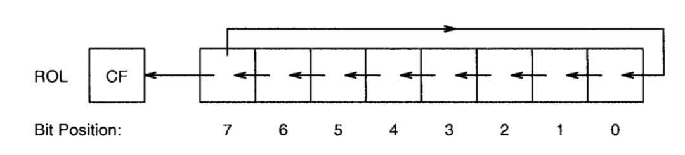
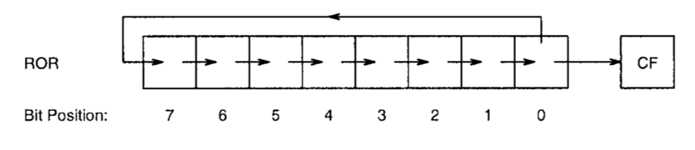

- [简介 (Introduction)](#%E7%AE%80%E4%BB%8B-introduction)
- [数据交换转换指令 (Data Exchange and Translate Instructions)](#%E6%95%B0%E6%8D%AE%E4%BA%A4%E6%8D%A2%E8%BD%AC%E6%8D%A2%E6%8C%87%E4%BB%A4-data-exchange-and-translate-instructions)
  - [XCHG 指令](#xchg-%E6%8C%87%E4%BB%A4)
  - [XLAT 指令](#xlat-%E6%8C%87%E4%BB%A4)
- [位移和轮转指令 (Shift and Rotate Instructions)](#%E4%BD%8D%E7%A7%BB%E5%92%8C%E8%BD%AE%E8%BD%AC%E6%8C%87%E4%BB%A4-shift-and-rotate-instructions)
  - [位移指令 (Shift Instructions)](#%E4%BD%8D%E7%A7%BB%E6%8C%87%E4%BB%A4-shift-instructions)
  - [轮转指令 (Rotate Instructions)](#%E8%BD%AE%E8%BD%AC%E6%8C%87%E4%BB%A4-rotate-instructions)
  - [不结合 CF 的轮转](#%E4%B8%8D%E7%BB%93%E5%90%88-cf-%E7%9A%84%E8%BD%AE%E8%BD%AC)
  - [结合 CF 的轮转](#%E7%BB%93%E5%90%88-cf-%E7%9A%84%E8%BD%AE%E8%BD%AC)
- [定义常量 (Defining Constants)](#%E5%AE%9A%E4%B9%89%E5%B8%B8%E9%87%8F-defining-constants)
  - [EQU 指令](#equ-%E6%8C%87%E4%BB%A4)
  - [%assign 指令](#assign-%E6%8C%87%E4%BB%A4)
  - [%define 指令](#define-%E6%8C%87%E4%BB%A4)
- [宏 (Macros)](#%E5%AE%8F-macros)
  - [没有参数的宏](#%E6%B2%A1%E6%9C%89%E5%8F%82%E6%95%B0%E7%9A%84%E5%AE%8F)
  - [有参数的宏](#%E6%9C%89%E5%8F%82%E6%95%B0%E7%9A%84%E5%AE%8F)
- [何时使用 XLAT 指令](#%E4%BD%95%E6%97%B6%E4%BD%BF%E7%94%A8-xlat-%E6%8C%87%E4%BB%A4)

## 简介 (Introduction)

上一节中已经提到过，汇编语言中以后三种语句类型: 指令，汇编器指令和宏(instructions, assembler directives and macros)。这一节将继续介绍两个指令 xchg 和 xlat。接着介绍 NASM 的指令来定义常量。最后介绍关 NASM 关于宏的支持。

## 数据交换转换指令 (Data Exchange and Translate Instructions)

这一节讨论了数据交换 xchag 和 转移(xlat) 指令。其他数据转移指令比如 movsx 和 movzx 将在 [Chapter 14]() 中讨论。

### XCHG 指令

xchg 指令用于交换 8、16、32位的 source 和 destination 操作数。语法和 mov 指令类似:

```asm
xchg    EAX,EDX
xchg    [response],CL
xchg    [total],DX
```

和 mov 指令一样，两个操作数不可以同时在内存中:

```asm
xchg    [response],[name1]  ;illegal
```

xchg 之所以方便是因为我们不必借助第三个寄存器去存放交换时的临时值。比如:

```asm
mov     ECX,EAX
mov     EAX,EDX
mov     EDX,ECX
```

使用 xchg 指令只需要:

```asm
xchg    EAX,EDX
```

对于两个字节的 16位 数的大小端序的转换，使用 xchg 指令也很方便:

```asm
xchg    AL,AH
```

另一个指令 bswap 只适用于 32位 的转换:

```
bswap   register
```
### XLAT 指令

xlat 指令可以用于字符转换。格式如下:

```
xlatb
```

为了使用该指令，EBX寄存器 必须为转换表的起始地址，并且 AL寄存器 必须为该表中的索引。xlat 指令将 AL 的内容和 EBX 的内容相加得到结果地址。结果将会写入到 AL 寄存器中。因为使用 AL寄存器 提供索引，所以表的最大容量为 256。

## 位移和轮转指令 (Shift and Rotate Instructions)

这一些讨论指令集中的位移和轮转指令，同簇的其他指令在 [Chapter 16]() 中讨论。

### 位移指令 (Shift Instructions)

指令集中提供了一些位移指令。我们主要讨论 shl 和 shr。语法:

```
shl     destination,count
shr     destination,count
shl     destination,CL
shr     destination,CL
```

左移的话，最左的 bit 位将保存在 CF 标志位中，右移的话，最右的 bit 位将保存在标志位 CF 中。count 的最大范围在 0~31，前者的形式效率更高，当位移范围超过操作数本身的位数时没有任何效果。

### 轮转指令 (Rotate Instructions)

位移的一个缺点在于位移出去的 bit 位都被丢弃了。而轮转指令弥补这一问题。轮转指令分为两种: 不结合 carry flag 的轮转 和 结合 carry flag 的轮转。

### 不结合 CF 的轮转

```
rol (ROtate left)
ror (ROtate right)
```

这些指令的格式和位移指令相似:

```
rol     destination,count
ror     destination,count
rol     destination,CL
ror     destination,CL
```

ROL:



ROR:



对于这两个指令来说，CF 都会捕获最后一个轮转出的 bit:


### 结合 CF 的轮转

结合 CF 的轮转就是将 CF 也加入到轮转中。在轮转过程中，转出的 bit 存如到 CF 中，CF 中之前的 bit 移动到空出的 bit 位。见下图:


一些例子见下图:


## 定义常量 (Defining Constants)

NASM 提供了一些指令来定义常量。这一节将讨论 EQU, %assign 和 %define

### EQU 指令

EQU 指令的语法:

```
name    EQU     expression
```

expression 应该是常量表达式。使用 EQU 指令有两个好处:

* 增加程序的可读性
* 达到程序多多处常量联动的效果

常量表达式的结果在汇编阶段被执行。EQU 指令的名称不可以被重复定义。如果需要重复定义的话，则需要使用 %assign 指令。

### %assign 指令

和 EQU 指令一样，%assign 指令也可以用来定义数字常量，不同的是，%assign 指令允许重复定义。比如定义:

```asm
%assign     i   j+1
```

随后可以被重复定义为

```asm
%assign     i   j+2
```

和 EQU 指令一样，当 %assign 指令没执行的时候，常量表达式会被求值。 %assign 指令是区分大小的，可以使用它的不分区大小写的版本 %iassign。

### %define 指令

这个指令和 C语言 中的 `#define` 指令类似，可以定义数字和字符类型的常量。比如：

```asm
%define     x1  [EBP+4]
```

和 %assign 指令一样，该指令也允许重复定义。它的不区分大小写版本是 %idefine

## 宏 (Macros)

宏提供了一个使用一个名称来表示一块代码(或者数据)的功能，通过该名称可以重复的使用它所指代的代码(或者数据)块。当汇编器执行到宏名称的时候，将会使用它所指代的代码(或者数据)块来替换名称。这个过程称为 宏展开(macro expansion)。

在 NASM 中，宏可以通过一组 %macro 和 %endmacro 来定义。两个指令之间的内容，就是宏的所包含的代码(或者数据)块。

```asm
%macro   macro_name   para_count
    ;macro body
%endmacro
```

para_count 表示了宏中所使用的参数个数。macro_name 就是在程序中使用的，当汇编器遇到它时，就会执行宏展开。可以通过 macro_name 和宏所需的参数来调用宏。

### 没有参数的宏

例子:

```asm
%macro  multEAX_by_16
    sal     EAX,4
%endmacro
```

调用:

```asm
mov     EAX,27
multEAX_by_16
```

展开后变成:

```asm
mov     EAX,27
sal     EAX,4
```

### 有参数的宏

例子:

```asm
%macro  mult_by_16  1
    sal     %1,4
%endmacro
```

使用:

```asm
mult_by_16  DL
```

被展开为:

```asm
sal     DL,4
```

## 何时使用 XLAT 指令

xlat 指令在进行字符转义的时候非常方便。灵活的运用 xlat 指令将会提高程序的运行效率。简单地说，就是需要进行字符查表转换的任务时，运用好 xlat 指令，会获得更高的性能。