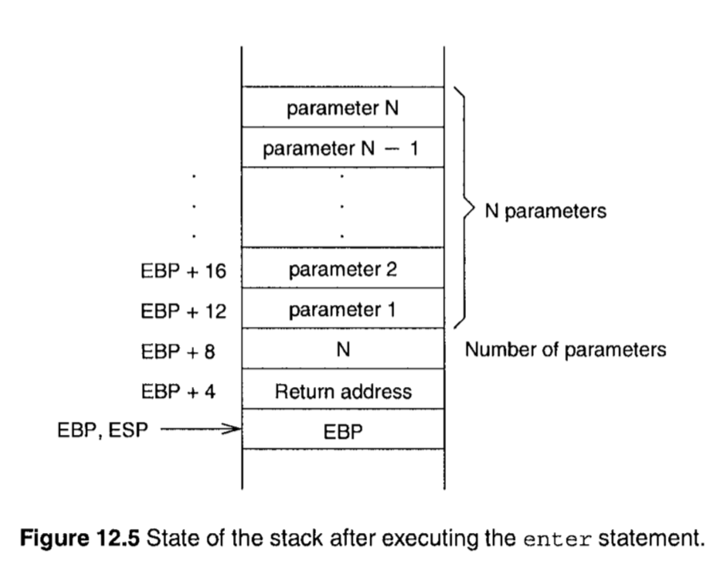

在前面的章节中，我们已经介绍了关于过程的基础内容。我们讨论了在调用过程时传递参数的两种方式。不过，我们还没有讨论在汇编语言中如何处理过程的局部变量，这一节将讨论这个内容。

尽管有些比较短的汇编程序可以写在单个文件中，真实的应用程序还是被分割到不同的文件中，这被称为模块化。这就涉及到如何将多个源文件进行汇编，我们也会讨论这一点。

大部分的高级语言在使用过程时接收固定数量的参数。不过像C语言支持变长参数。最后一节我们将讨论这个内容。

## 简介 (Introduction)

这一节的关注点在: 处理局部变量，模块化程序，传递变长参数。

我们尚未考虑如何在过程中使用局部变量。注意这个C语言的例子:

```c
int compute(int a, int b) {
  int temp, N;
}
```

变量 temp 和 N 是局部变量。它们的作用域被限定在过程的内部。当过程被调用的时候，它们开始存在，当过程结束调用之后，它们也就消失了。同传参一样，我们也可以使用寄存器或者栈来处理局部变量。下一节讨论。

书中目前为止的程序都是单文件的，但是模块化的程序有这几点好处:

* 加快汇编的速度，当模块化之后，只需要汇编修改过的模块。如果都写在单个文件中的话，那么所有修改都需要重新汇编整个程序
* 内容较小的文件修改起来更加的容易
* 文件修改起来更加的安全；因为即使是一个不小心的修改，也只会影响到当前的文件。

比如C语言的 scanf 和 printf，是很典型的接收变长参数的函数，由于被调用者并不知道调用者提交了多少参数，所以第一个参数往往是提交的参数数量。

## 局部变量 (Local Variables)

使用寄存器来处理局部变量的缺点和处理传参的缺点一样，寄存器数量有限。

使用数据段来处理局部变量的缺点是：

* 不如何过程的生命周期，因为局部变量在过程未被调用的时候就已经激活了，并且在过程调用结束后也不会消失。
* 在应对 noleaf 和 递归(recursive) 的时候也无能为力。

基于这几个原因，使用栈来提供局部变量的空间。对于上面的C语言例子，图12.1 展示了栈的内容。在高级语言中，这些内容又被称为 activation record，这是因为每个过程的活动都需要所有这些信息。EBP 的值，称为 frame pointer，允许我们访问 栈帧(stack frame) 的内容


比如，参数 a 和 b 可以通过 `EBP + 12` 和 `EBP + 8` 来访问。局部变量 temp 和 N 可以通过 `EBP - 4` 和 `EBP - 8` 来访问。

为了增加程序的可读性，我们可以使用 %define 指令来给栈上的位置命名:

```asm
%define     a       dword   [EBP+12]
%define     temp    dword   [EBP-4]
mov     EBX,a
mov     temp,EAX
; instead of
mov     EBX,[EBP+12]
mov     [EBP-4],EAX
```

## 模块化 (Multiple Source Program Modules)

如果我们希望汇编器能够正确处理一个过程调用位于另一个源文件中的过程的话，就需要借助指令 global 和 extern。

### GLOBAL 指令

global 使得相关的 标注(labels) 可以被其它模块所见。格式:

```asm
global  label1, label2, ...
```

几乎所有的标注都可以变成 公共(public) 的。包括 过程名称(procedure name)，内存变量(memory variables) 和 equated labels，比如:

```
global  error_msg,  total,  sample

.DATA
error_msg   db  'Out of range!', 0
total       dw  0
    ;...

.CODE
    ;...

sample:
    ;...
    ret
```

Microsoft 和 Borland 的汇编器使用 PUBLIC 指令完成相同的工作。

### EXTERN 指令

extern 指令告诉汇编器某些标注并不在当前源文件中，但是可以在其他源文件中找到。因此，汇编器会在相应的 目标文件(object file) 中留空，等待后续的 链接(link)。格式：

```
extern  label1, label2, ...
```

label1 和 label2 在其他源文件中被使用 global 指令声明为公共的。

## 具有变长参数的过程 (Procedure with Variable Number of Parameters)

在汇编语言中，用栈来处理传递给过程的变长参数是容易的。参数的数量只受到栈的大小限制。下面通过一个例子演示汇编语言中如何完成变长参数的传递。

### 例12.3 通过栈传递变长参数

在这个例子中，过程 variable_name 通过栈接收变长参数。实际的参数数量是在调用过程前最后一个压入栈中的参数。过程将会计算这些参数的加法结果，然后通过 EAX寄存器 返回结果。



### 一些注意点


* 如果使用的是 Linux 系统，那么可以省略段重叠前缀(segment override prefix)。这是因为 Linux 和 UNIX 系统没有使用 IA-32 架构提供的物理分段功能。而是将整个系统内存当成一个大的物理分段，并在此之上进行了逻辑分段。图12.6 展示了 Linux 的内存分布。最下面的两个分段用来保存 code 和 data。比如 代码段(.text) 保存在最下面的段，这个段是只读的。栈段位于内核空间的下方。
* 这个例子中，我们通过段重置前缀小心地使用了 EBX。我们可以直接使用 EBX 来访问参数:

  ```asm
    add   EBP,12
    sub   EAX,EAX
  add_loop:
    add   EAX,[EBP]
    add   EBP,4
    loop  add_loop    
  ```
  但是这样做会因为修改了 EBP 导致丢失对其他内容的访问，比如无法再访问到参数数量。后面的介绍如何更好的处理这个问题
* 另一个有趣的点在于，栈是由 main 进行清理的。因为我们提交的变长参数，无法在被调用的过程中完成栈的释放。

### 例子12.8

第 35 行的 `inc ECX` 之所以要加 1，是因为我们提交的是变长的参数，在提交变长参数的时候，除了参数本身，还提交了参数个个数，这个参数的个数是最后一个入栈的，也就是第一个参数，所以这里在释放栈空间的时候，也需要将这个「参数个数」所占据的栈空间释放。