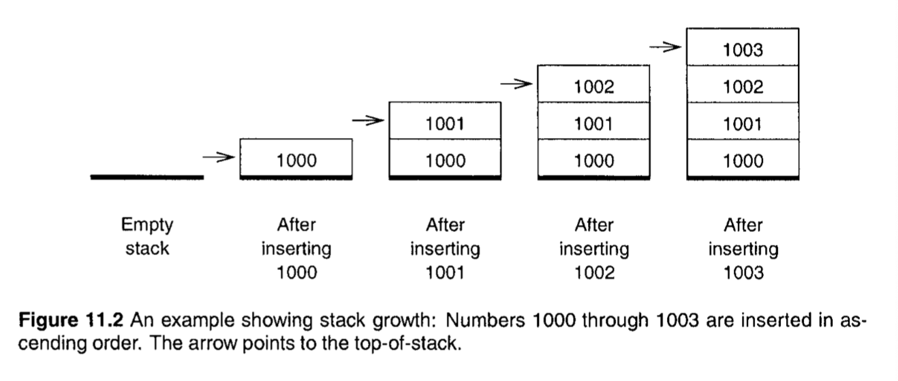
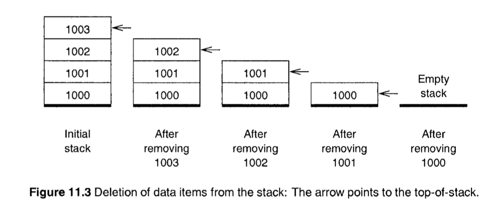
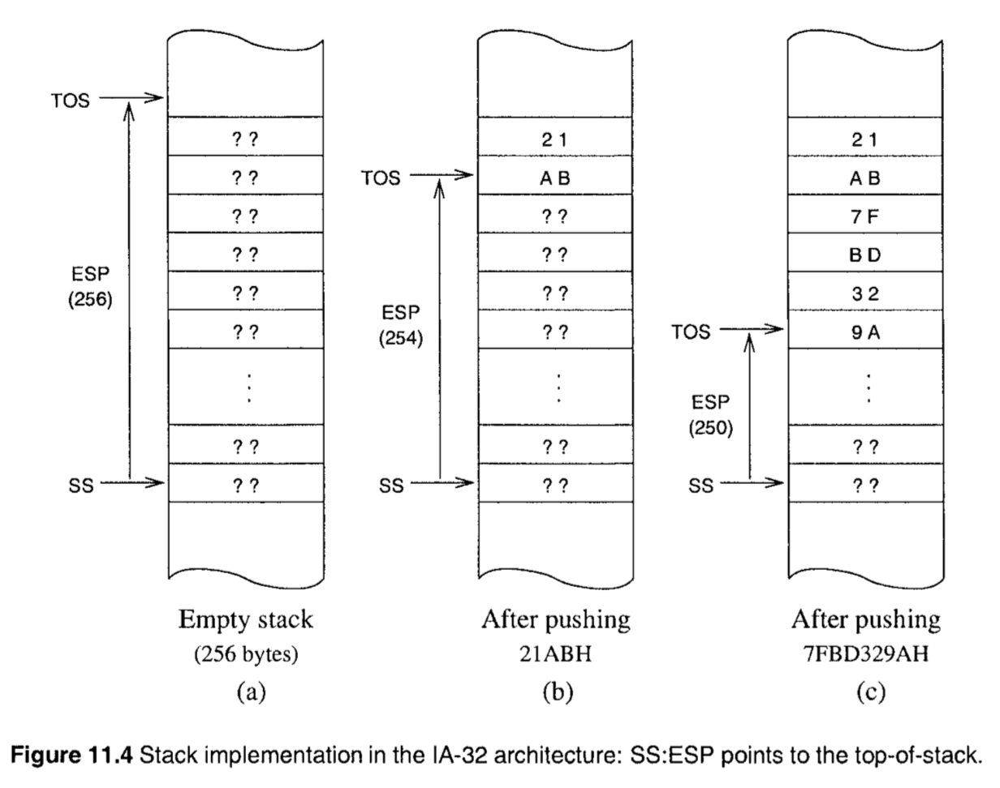
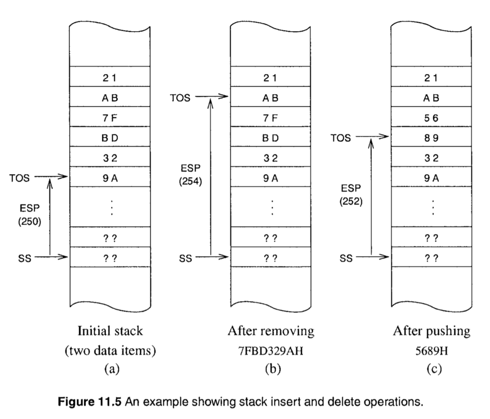
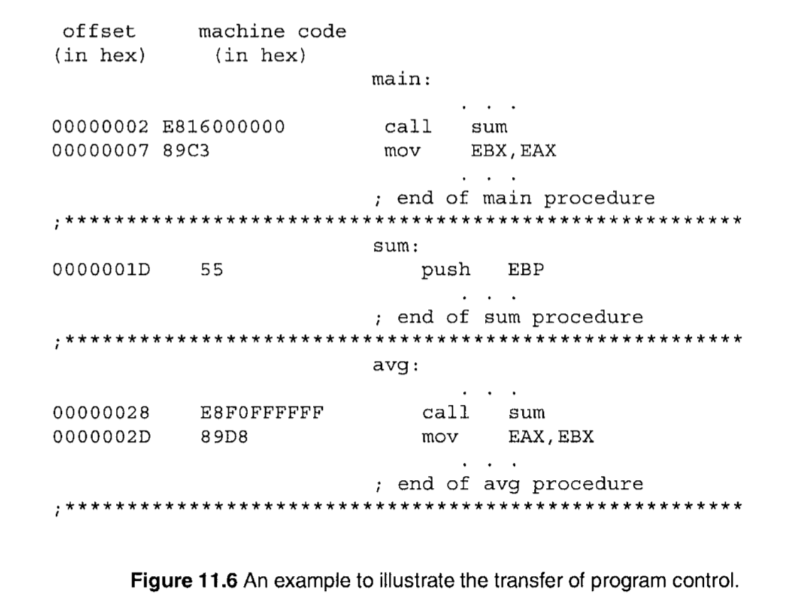
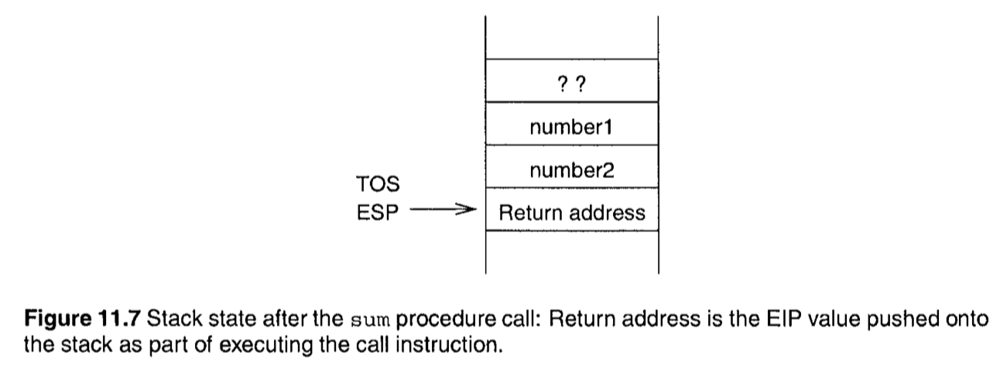

- [简介 (Introduction)](#%E7%AE%80%E4%BB%8B-introduction)
- [什么是栈 (What Is a Stack?)](#%E4%BB%80%E4%B9%88%E6%98%AF%E6%A0%88-what-is-a-stack)
- [栈的实现 (Implementation of the Stack)](#%E6%A0%88%E7%9A%84%E5%AE%9E%E7%8E%B0-implementation-of-the-stack)
- [栈的相关操作 (Stack Operations)](#%E6%A0%88%E7%9A%84%E7%9B%B8%E5%85%B3%E6%93%8D%E4%BD%9C-stack-operations)
  - [基本指令 (Basic Instructions)](#%E5%9F%BA%E6%9C%AC%E6%8C%87%E4%BB%A4-basic-instructions)
  - [附加指令 (Additional Instructions)](#%E9%99%84%E5%8A%A0%E6%8C%87%E4%BB%A4-additional-instructions)
  - [栈对标志的操作 (Stack Operations on Flags)](#%E6%A0%88%E5%AF%B9%E6%A0%87%E5%BF%97%E7%9A%84%E6%93%8D%E4%BD%9C-stack-operations-on-flags)
  - [栈对所有通用寄存器的操作 (Stack Operations on All General-Purpose Registers)](#%E6%A0%88%E5%AF%B9%E6%89%80%E6%9C%89%E9%80%9A%E7%94%A8%E5%AF%84%E5%AD%98%E5%99%A8%E7%9A%84%E6%93%8D%E4%BD%9C-stack-operations-on-all-general-purpose-registers)
- [栈的使用 (Uses of the Stack)](#%E6%A0%88%E7%9A%84%E4%BD%BF%E7%94%A8-uses-of-the-stack)
  - [存放临时数据 (Temporary Storage of Data)](#%E5%AD%98%E6%94%BE%E4%B8%B4%E6%97%B6%E6%95%B0%E6%8D%AE-temporary-storage-of-data)
  - [转移控制 (Transfer of Control)](#%E8%BD%AC%E7%A7%BB%E6%8E%A7%E5%88%B6-transfer-of-control)
  - [传参 (Parameter Passing)](#%E4%BC%A0%E5%8F%82-parameter-passing)
- [过程指令 (Procedure Instructions)](#%E8%BF%87%E7%A8%8B%E6%8C%87%E4%BB%A4-procedure-instructions)
  - [程序控制是如何被转移的 (How Is Program Control Transferred?)](#%E7%A8%8B%E5%BA%8F%E6%8E%A7%E5%88%B6%E6%98%AF%E5%A6%82%E4%BD%95%E8%A2%AB%E8%BD%AC%E7%A7%BB%E7%9A%84-how-is-program-control-transferred)
  - [返回指令 (The ret Instruction)](#%E8%BF%94%E5%9B%9E%E6%8C%87%E4%BB%A4-the-ret-instruction)
- [传参 (Parameter Passing)](#%E4%BC%A0%E5%8F%82-parameter-passing-1)
  - [寄存器传参 (Register Method)](#%E5%AF%84%E5%AD%98%E5%99%A8%E4%BC%A0%E5%8F%82-register-method)
    - [寄存器传参的利弊](#%E5%AF%84%E5%AD%98%E5%99%A8%E4%BC%A0%E5%8F%82%E7%9A%84%E5%88%A9%E5%BC%8A)
  - [栈传参 (Stack Method)](#%E6%A0%88%E4%BC%A0%E5%8F%82-stack-method)
  - [该由谁来清理栈 (Who Should Clean Up the Stack?)](#%E8%AF%A5%E7%94%B1%E8%B0%81%E6%9D%A5%E6%B8%85%E7%90%86%E6%A0%88-who-should-clean-up-the-stack)
  - [保存调用者的状态 (Preserving Calling Procedure State)](#%E4%BF%9D%E5%AD%98%E8%B0%83%E7%94%A8%E8%80%85%E7%9A%84%E7%8A%B6%E6%80%81-preserving-calling-procedure-state)
  - [哪些寄存器需要被保存 (Which Registers Should Be Saved?)](#%E5%93%AA%E4%BA%9B%E5%AF%84%E5%AD%98%E5%99%A8%E9%9C%80%E8%A6%81%E8%A2%AB%E4%BF%9D%E5%AD%98-which-registers-should-be-saved)
  - [When to Use pusha](#when-to-use-pusha)
  - [ENTER 和 LEAVE 指令](#enter-%E5%92%8C-leave-%E6%8C%87%E4%BB%A4)

在结构化编程中，过程(procedure) 是一个重要的组成部分。IA-32架构中，栈在过程的调用和执行中扮演了重要的角色。我们也会描述汇编语言指令如何维护栈。

在介绍了栈之后，我们将看一看 过程(procedure) 的调用和返回的指令。和高级语言不同，汇编语言在调用过程时，不支持传递参数。有两种解决方式: 通过寄存器，通过栈。将详细讨论这两种方式。

## 简介 (Introduction)

过程(procedure) 被设计为一个逻辑上的独立单元，用于执行特定的任务。有时也被称为子程序(subprograms) 在模块化编程中扮演很重要的角色。

```c
int sum(int x, int y) {
  return (x + y);
}
```

有两种参数的传递机制: 传值(call-by-value) 和 传引用(call-by-reference)。上面的例子就是传值调用。传引用调用的例子:

```c
void swap(int* a, int* b) {
  int tmp;
  tmp = *a;
  *a = *b;
  *b = tmp;
}
```

总的来说，过程接收一组参数，参数可以是传值也可以是传引用，如果需要返回多个值，那么就必须使用传引用的方式了。

在汇编语言中，没有高级语言那么方便。指令集只提供了如何基础的调用过程的指令，没有支持调用同时传递参数。如果我们需要传递参数，则需要使用一些调用者和被调用者之间共享的空间。通常来说，可以使用寄存器，或者栈。

## 什么是栈 (What Is a Stack?)

从概念上来说，栈是一个 后进先出(last-in-first-out LIFO) 的数据结构。栈有两个相关的操作: 插入(insertion) 和 删除(deletion)。栈中唯一可以被访问的元素就是栈顶(top-of-stack TOS)元素。在栈的术语中，插入和删除被称为 push 和 pop。

栈可以被看成是一个插入和删除只能在末尾进行的数组。另一个相关的数据类型，叫做 队列(queue)，可以被看成是一个插入和删除分别位于两端的数组。队列是一个 先进先出(first-in-first-out FIFO) 的数据结构。

栈的插入:



栈的删除:



## 栈的实现 (Implementation of the Stack)

栈段中预留的内存空间就是用来实现栈的。寄存器 SS 和 ESP 用来实现栈。栈顶元素，指向最后一个插入栈的元素由 SS:ESP 来表示。其中 SS 表示栈段的起始地址，并且 ESP 指向提供一个插入的元素的偏移量。

实现栈的主要指标如下:

* 只有 words(16bit) 或者 doublewords(32bit) 保存在栈上，不会保存单个字节
* 栈向内存低地址方向增长。因为我们经常在图中由下往上的表示内存的增长，所以我们又称栈为下降的(downward)。
* 栈顶总是指向最后一个放入的元素。TOS 总是指向最后放入栈的字的低字节，比如，当将 21ABH 压入栈中后，TOS 指向 ABH，见图11.4



图11.4a 展示了一个具有 256字节 的空栈。当栈被初始化后，TOS 指向栈外的多一个字节。当栈为空时，读取栈会引发 stack underflow 异常。

当一个字被压入栈中时，ESP 先减少 2，然后字被保存在 SS:ESP。因为 IA-32架构使用的是小端序，所以高位字节保存在高地址。

当 ESP 为 0 时表示栈满了。此时再试图压入栈将会引发 stack overflow 异常。stack underflow 和 stack overflow 都是编程错误，需要被妥善处理。

当从栈中取出一个 32位 的元素时，会使得偏移量减少 4、指向了栈中的接下来的元素。比如，当我们从栈中取出一个双字的元素，见图11.5b。注意那些内存数据并没有改变。不过，TOS 被更新了，这些内存将会在下一次的压栈操作中被覆盖，见图11.5c。



## 栈的相关操作 (Stack Operations)

### 基本指令 (Basic Instructions)

栈数据结构允许两个基本操作: 插入一个数据元素到栈(称为 push)，从栈中删除一个元素(称为 pop)。这两个操作可以操作字或者双字。语法如下:

```asm
push    source
pop     destination
```

这两个指令的操作数可以是 16 或者 32位 通用寄存器，段寄存器，或者内存中的一个字或者双字。除此之外，push指令的 source 可以是立即数(8、16、32位)。不过需要注意的是，并不会真的向栈中压如一个字节，而是压如相应的 16位 或者 32位 值。

### 附加指令 (Additional Instructions)

指令集中为栈的维护提供了两个特殊的指令。这些指令可以用于保存和恢复标志和通用寄存器的内容。

### 栈对标志的操作 (Stack Operations on Flags)

push 和 pop 指令不能用来保存和恢复标志寄存器。为此，两个提供了两个特殊的指令:

```asm
pushfd      (push 32-bit flags)
popfd       (pop 32-bit flags)
```

这两个指令不需要操作数。为了操作 16位 寄存器 FLAGS，我们可以使用 pushfw 和 popfw 指令。因为在我们的程序中，默认的操作数就是 32位的，所以 pushf 可以作为 pushfd 的别名，同样的 popf 可以作为 popfd 的别名。

### 栈对所有通用寄存器的操作 (Stack Operations on All General-Purpose Registers)

指令集中还有指令 pusha 和 popa 指令，可以用于将 8个 通用寄存器的内容进行保存和恢复。pushad 保存 32 位寄存器的内容，EAX, ECX, EDX, EBX, ESP，ESI, EDI。这些寄存器按序被压入栈。popad 指令恢复这些寄存器的内容，除了 ESP寄存器。相应的 16位指令时 pushaw 和 popaw。这些指令在过程调用中起到作用，将在后面进行介绍。和 pushf、popf 一样，我们也可以使用 pusha 和 popa 作为别名。

## 栈的使用 (Uses of the Stack)

栈主要有三种用途: 作为保存临时数据的便签，为了转移程序控制，为了调用过程时传递参数。

### 存放临时数据 (Temporary Storage of Data)

栈可以作为存放临时数据的便签。比如，考虑交换两个32位内存中的变量值: value1 和 value2，我们不能使用，这是因为两个操作数都在内存中:

```asm
xchg    value1,value2   ;illegal
```

下面的代码可以工作:

```asm
mov     EAX,value1
mov     EBX,value2
mov     value1,EBX
mov     value2,EAX
```

但是它使用了两个32位寄存器，在寄存器有限的情况下，显得有些浪费。另外为了保持两个寄存器原有的值，完整的的代码如下:

```asm
; save EAX and EBX registers on the stack
push    EAX
push    EBX
; EAX and EBX registers can now be used
mov     EAX,value1
mov     EBX,value2
mov     value1,EBX
mov     value2,EAX
; restore EAX and EBX registers from the stack
pop     EBX
pop     EAX
```

这段代码需要八次内存访问。因为栈的是一个 LIFO 数据结构，更为优雅的实现如下:

```asm
push    value1
push    value2
pop     value1
pop     value2
```

上面的代码没有使用任何的通用寄存器。并且注意到 push 和 pop 指令允许内存到内存的操作(比如，在数据段和代码段之间)。

栈还经常作为保存和恢复寄存器的便签。这是因为需要将寄存器腾出来执行当前的任务，这经常发生在过程调用中。

需要清楚的是，栈的内容在程序的运行过程中是不断的增长和收缩的，所以分配一个足够大的栈是很重要的，否则会引发 stack underflow 和 stack overflow，会导致无法预测的结果，甚至是系统错误。

### 转移控制 (Transfer of Control)

前面讨论了以程序员的角度来使用栈进行保存和恢复数据。栈还被一些指令用来保存和恢复临时数据。实际上，当一个过程被调用时，返回地址会被压入栈中，这样才能后在调用结束后返回到调用程序，下一节将讨论这些。

### 传参 (Parameter Passing)

栈的另一个重要作用是在过程调用时作为传参的媒介。高级语言都依赖于这个功能。随后会讨论到。

## 过程指令 (Procedure Instructions)

在汇编语言中，提供了 call 和 ret 指令来编写过程。call指令 的格式如下:

```asm
call    proc-name
```

proc-name 是需要被调用的过程的名称。汇编器会将 proc-name 替换为过程的第一条指令的偏移量。

### 程序控制是如何被转移的 (How Is Program Control Transferred?)

提供给 call指令 中的偏移量不是绝对值(偏移量不是相对于保存在CS寄存器中的代码段的起始地址的)，而是一个相对的位移。见图11.6



当 main 中的 call指令 被取出后，EIP寄存器指向了下一条将被执行的指令(EIP = 00000007H)。这是在过程 sum 执行完成后需要执行的指令。处理器为了记住这个值，将 EIP 的内容其压入栈中。

现在，将控制转移到 sum 过程中的第一条指令，EIP 寄存器需要载入 sum 中下面指令的偏移量:

```asm
push    EBP
```

为了完成这个步骤，处理器将一个在 call指令 中发现的 32位的相对位移 和 EIP寄存器 中的内容相加。注意我们的例子，call指令 的机器码为 `E816000000H`。第一个字节 `E8H` 是 call 指令的操作码(opcode)，接下来的 4个字节有符号数值 就是相对位移，就是过程第一条指令和 call指令 下一条指令之间的相对位移，在例子中就是  `0000001DH - 00000007H = 00000016H`。需要注意的是，指令中的相对位移是小端序的，等于 00000016H。将相对位移加上 EIP寄存器 的内容，使得 EIP寄存器指向了 sum 的第一条指令。

注意 main 中的调用是一个向前调用，因此相对位移是正数。在 avg 中的 sum 调用，就是向后调用，此时相对位移是一个负数。根据上面得到相对位移的方式，这里的相对位移为 `0000001DH- 0000002DH = FFFFFFF0H`，因为负数使用其 2的补码 形式，`FFFFFFF0H` 对应 `-10H`。

下面就是在进行过程调用是的动作:

```
ESP=ESP-2                         ;push return address onto the stack
SS:ESP=EIP      
EIP=EIP + relative displacement   ;update EIP to point to the procedure
```

相对位移是一个 32位的有符号数，以此来表示向前还是向后调用。

### 返回指令 (The ret Instruction)

ret指令 用于将控制从被调用的过程中返回给调用者。Return 将控制转移到 call指令 的下一条指令。处理器是如何知道指令在何处的？还记得处理器在进行 call指令 动作的时候进行了记录吗？当 ret指令 执行时，栈上的 return address 被恢复。在执行 ret 指令的动作类似：

```
EIP=SS:ESP      ;pop return address at TOS into IP
ESP=ESP+4       ;update TOS by adding 4 to ESP
```

一个可选的整数可以包含在 ret 指令中:

```
ret     8
```

可选的数将会在后面讨论到。

## 传参 (Parameter Passing)

汇编语言中有两种传参方式: register method 和  stack method。顾名思义，register method 使用通用寄存器来传参，而 stack method 使用栈来传参。

### 寄存器传参 (Register Method)

在这个方法中，调用者需要将所需的参数先放置到寄存器中，然后再调用目标过程。

#### 寄存器传参的利弊

好处:

* 对于比较小的数而言是很方便和有效的
* 效率更高，因为所有的参数都在寄存器中了

坏处:

* 主要的缺点就是传参的数量有限，因为通用寄存器的数量有限。
* 另一个缺点是过程中也需要使用到寄存器，因此在传参前需要保存寄存器的内容，并且之后需要恢复，而保存寄存器的内容就需要有内存访问，这就抵消了上面的第二条好处。

### 栈传参 (Stack Method)

在这个方法中，在调用过程前，先将所需的参数压入栈中。比如:

```asm
push    number1
push    number2
call    sum
```

在执行了 call指令 后，EIP 的内容内自动的压入栈中，栈的状态如图11.7



可以直接使用寄存器来取出参数:

```asm
pop     EAX
pop     EBX
pop     ECX
```

但是这样做的缺陷也很明显，和寄存器传参的缺点类似，由于通用寄存器的数量有限，该方法在应对多个参数时束手无措，并且由于使用了寄存器来保存参数，占据了本应执行计算任务的寄存器。

最好的方式就是将参数放在栈上，在需要的时候才读取它们。

有一种方式是，以为你栈是一个连续的内存，`ESP + 4` 指向了 number2，`ESP + 6` 指向 number1。这样的操作也是具有局限性的，因为 ESP寄存器 会被 push 和 pop 指令所更新。

有一个更好的方案: 我们可以使用 EBP寄存 替代 ESP寄存器。比如:

```asm
mov     EBP,ESP
mov     EAX,[EBP+4]
```

这是一般的指向栈上参数的方式。因为每个过程都会使用到 EBP寄存器，所以 EBP寄存器 在使用之前需要先保存，以便后续恢复：

```asm
push    EBP
mov     EBP,ESP
```

注意这就使得参数的位移又增加了 4个字节，见图11.8a。

参数，返回值，和原有的 EBP 值一起被称为 stack frame。如果过程包含本地变量的话，那么 stack frame 也将包含它们。EBP 值也被称为 frame pointer(FP)。一旦知道了 EBP 的值，那么我们可以访问所有 stack frame 中的元素。

在从过程中返回前，我们必须:

```asm
pop     EBP
```

来恢复之前的 EBP 的内容。见过见图11.8b。

ret指令 使得 return address 被载入 EIP寄存器，并且在 ret指令 执行后，栈的状态见图11.8c。

现在的问题在于参数占据的栈空间还没有被释放。第一种释放参数的方式是在过程调用后增加 ESP，如：

```asm
push    number1
push    number2
call    sum
add     ESP,4
```

比如，C 语言编译器使用这个方式来释放栈上的参数。上面的汇编代码等于下面的 C语言函数调用:

```c
sum(number2, number1);
```
除了让调用者释放栈空间外，被调用的过程也可以释放栈，注意我们不能写成:

```asm
sum:
    add     ESP,4
    ret
```

这是因为当 ret指令 执行时，ESP 必须指向位于栈上的 return address。解决方案就是使用 ret指令 的可选参数。格式为:

```asm
ret     optional-value
```

类似下面的动作:

```
EIP=SS:ESP
ESP=ESP + optional-value
```
optional-value 必须是一个数值，因为可选值得目的就是释放栈上的参数，所以该值为正数。

### 该由谁来清理栈 (Who Should Clean Up the Stack?)

我们已经讨论了下面两种方式来释放栈上无用的参数:

* 由调用者释放
* 由被调用者释放

如果过程要求一个固定数量的参数，那么推荐第二种方式。在这个情况下，我们只需要在被调用者这一边完成栈的清理，而不用再多次调用时在调用方做多次相同的清理动作。不过，如果过程接收变长的参数，那么只能选择第一种方式。

### 保存调用者的状态 (Preserving Calling Procedure State)

简单的说就是当调用过程时，需要先妥善的保存当前过程的运行状态，以便在调用结束后可以继续运行。

### 哪些寄存器需要被保存 (Which Registers Should Be Saved?)

这个问题的回答很简单: 保存那些被调用者使用的，但是可能会被被调用者修改的寄存器。这就引申出接下来的问题: 应该由调用者还是被调用者进行保存操作。

如果有调用者来进行保存，会遇到两个困难：

* 调用者可能调用多个过程，这些过程可能使用不同的寄存器。到最后可能需要调用者保存所有使用到的寄存器
* 程序可能会变得很长，因为每次调用前都需要调用者进行保存，调用后进行恢复。

另外，一般情况下不会选择 pusha，因为有可能会保存那些本无需保存的寄存器。

基于这几个原因，由被调用者保存那些它需要使用的寄存器，并在返回前恢复它们。这些符合模块化程序的设计原则。

### When to Use pusha

真正需要的时候用它。

### ENTER 和 LEAVE 指令

enter指令 的格式:

```asm
enter   bytes,level
```

bytes 表示过程需要使用多少字节来存放局部变量。


```asm
enter   XX,0
```

等价于:

```asm
push    EBP 
mov     EBP,ESP
sub     ESP,XX
```

leave 指令实际上执行了：

```asm
mov     ESP,EBP
pop     EBP
```

我们在 ret 指令之前使用 leave 指令，下面是一个过程的模板:

```asm
proc-name:
    enter   XX,0
    ;procedure body
    leave
    ret     YY
```
如果过程需要使用局部变量，则 XX 为非 0 值。YY 用于清除传入的位于栈上的参数。